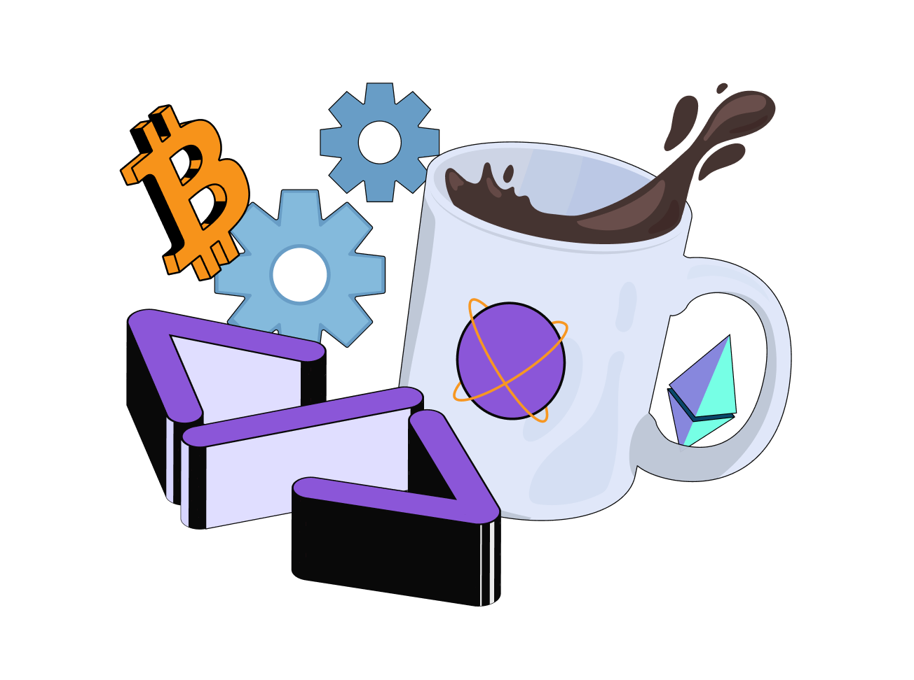

---
hide:
    - toc
---

   

   

      <h1 class="hero-heading">Developers</h1>
      
Your resource hub for seamless onboarding and support within our evolving ecosystem.

   

    

   

      <a href="/templates/omni_chain_ERC20/">
         

            
Templates

         

         
Explore our library of ready-made templates, offering instant integration of common use cases or smart contracts, streamlining your blockchain development process.

      </a>
   

   

      <a href="/Dojima/faucet/">
         

            
Faucet

         

         
The Faucet is a web-based service that can send you some test tokens so that you can explore and experiment with testnet without having to pay for anything.

      </a>
   

