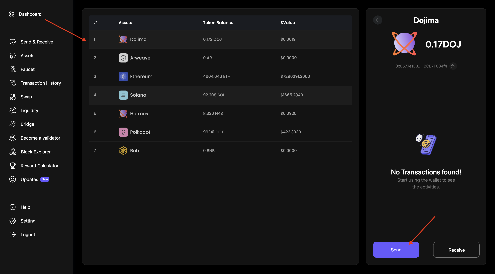
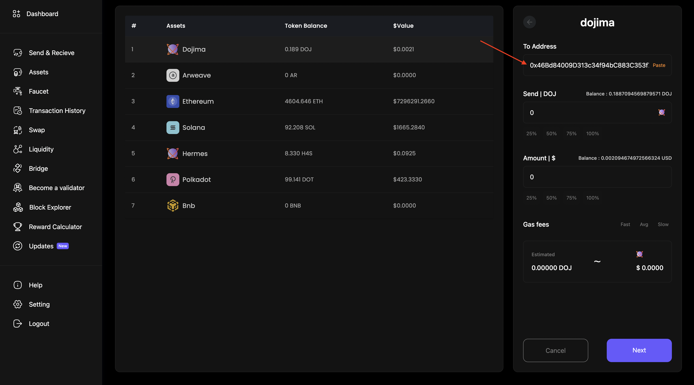
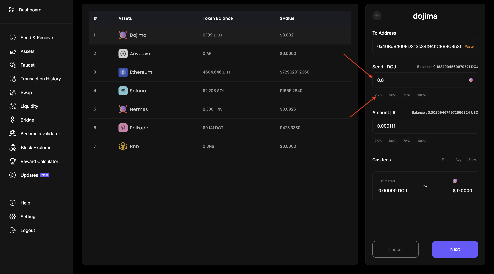
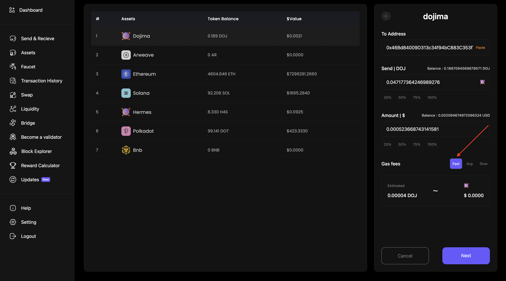
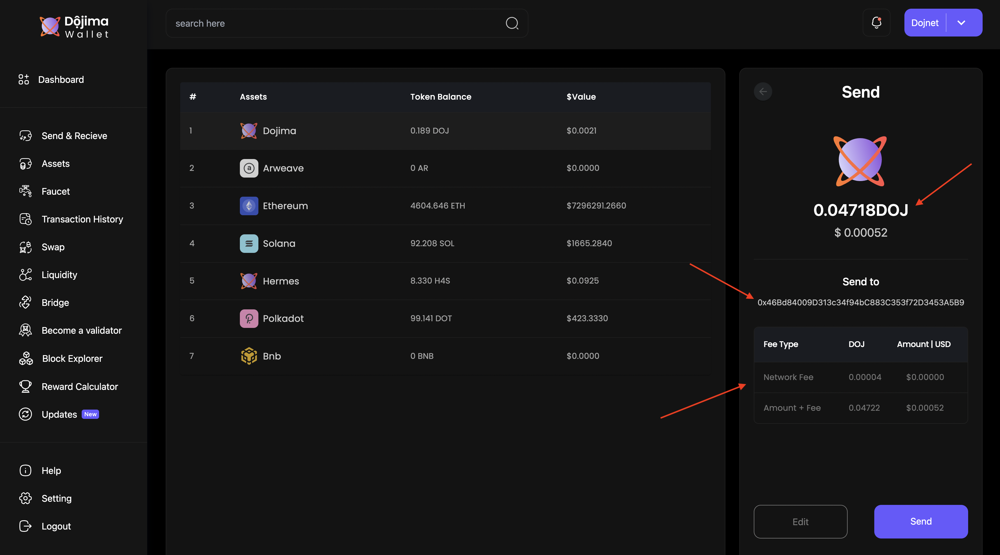
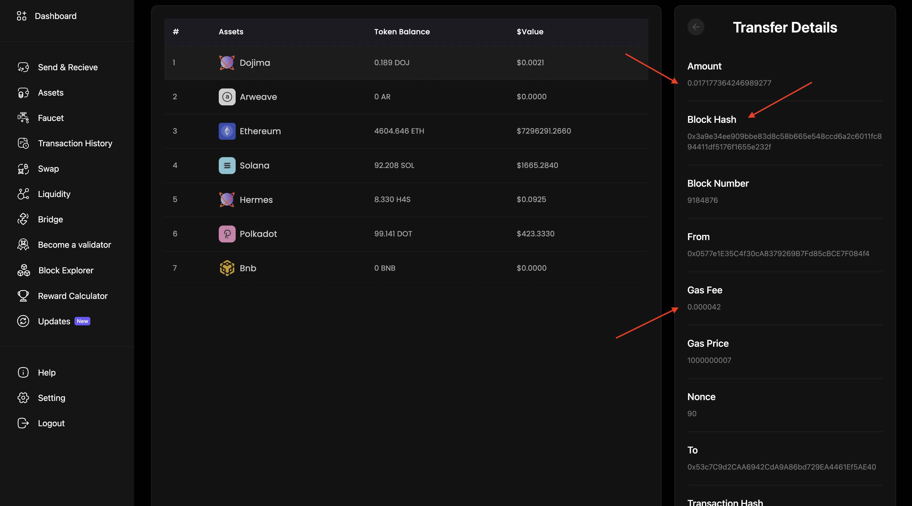

## Here's the guide to sending a Dojima coin to any account

#### **1**.  First, log into your [Dojima Wallet](https://wallet.dojima.network/wallet/intro) account. If you don't have a seed phrase, [follow these steps](../wallet/index.md).

!!! info
    If you don't have Doj Tokens, [proceed to FAUCET to get testnet tokens](https://wallet.dojima.network/wallet/main/faucet).

#### **2**.  Select Dojima coin and select 'Send'.

#### **3**.  Enter the receiver's Dojima Public Address.

#### **4**.  Enter the amount to send.

#### **5**.  Choose the network speed.

#### **7**.  Verify the details, like the receiver's public address, the transfer amount, and the network speed

#### **8**.  Transaction completed anf details get displayed

