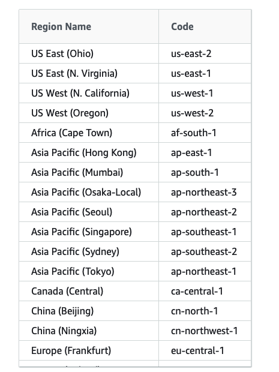
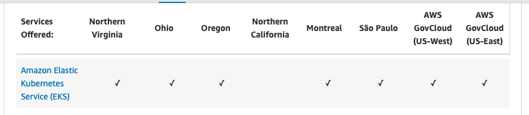

Setting up a Kubernetes Cluster with AWS

## Deploy a Kubernetes cluster in AWS using EKS service.

### Requirements

1. AWS account
2. CLI and AWS credentials configured
3. AWS IAM Authenticator
4. `kubectl`
5. wget (required for EKS module)

!!! warning
    LINUX/MACI is preffered method of setup

    Windows should choose either

    
    1. Deploy a HermesNode from a Linux VPS. 
    2. Use Windows Subsystem for Linux - [https://docs.microsoft.com/en-us/windows/wsl/about](https://docs.microsoft.com/en-us/windows/wsl/about)
    
## Steps

Firstly, clone and enter the [cluster-launcher repository](https://github.com/dojimanetwork/validator-cluster-launcher) **(Currently This Repo Link is Private Not Accessible By Outside Origanization)**. All commands in this section are to be run inside this repo.

```
git clone https://github.com/dojimanetwork/validator-cluster-launcher
cd cluster-launcher
```

Then install the [terraform CLI](https://www.terraform.io/):

=== "LINUX/MAC"

    Install Terraform:

    ```jsx
    brew install terraform
    ```

### AWS CLI

In order for Terraform to run operations on your behalf, you must install and configure the AWS CLI tool. \*\*\*\*To install the AWS CLI, follow [these instructions](https://docs.aws.amazon.com/cli/latest/userguide/install-cliv2-mac.html), or choose a package manager based on your operating system

=== "LINUX/MAC"
     Use the package manager [homebrew](https://formulae.brew.sh/) to install the AWS CLI.

        ```jsx
        brew install awscli
        aws configure
        ```

!!! warning
    You will be asked for you Personal Access Token with read/write privileges (retrieve from API Panel from the GCP web console.)
    **API -> Tokens/Keys -> Create Token**.
    Make sure you handle your secrets securely!

### AWS IAM Authenticator

You also must install and configure the **AWS IAM Authenticator tool**. To install, follow [these instructions](https://docs.aws.amazon.com/eks/latest/userguide/install-aws-iam-authenticator.html), or choose a package manager based on your operating system.

=== "LINUX/MAC"

    Use the package manager homebrew to install the **AWS IAM Authenticator**.

    ```jsx
    brew install aws-iam-authenticator
    ```

### Kubernetes Control Tool

You must install and configure the Kubernetes CLI tool (kubectl). **To install kubectl** , follow [these instructions](https://kubernetes.io/docs/tasks/tools/install-kubectl/), or choose a package manager based on your operating system.

Use the package manager homebrew to install the **AWS IAM Authenticator**.

=== "LINUX/MAC"

    Use the package manager [homebrew](https://formulae.brew.sh/) to install **kubectl**.

    ```jsx
    brew install kubernetes-cli
    ```

### wget && jq

You also need **wget** and **jq**, follow [these instructions](https://www.gnu.org/software/wget/), or choose a package manager based on your operating system.


=== "LINUX/MAC"

    Use the package manager [homebrew](https://formulae.brew.sh/) to install wget and jq Note: You most likely have these installed already.

    ```jsx
    brew install wget
    brew install jq
    ```


## Deploy Kubernetes Cluster

Use the commands below to deploy a DOKS cluster:

```
make aws
```

During the deploy, you will be asked to enter information about your cluster


1. Name
2. AWS Region -- see valid [List of Regions](https://docs.aws.amazon.com/general/latest/gr/rande.html#regional-endpoints)
3. Confirm `yes`



Regions



Note: AWS EKS is not available in some regions

or manually

```
cd aws/
terraform init
terraform plan # to see the plan
terraform apply
```

Final success message: `Apply complete! Resources: 30 added, 0 changed, 0 destroyed`.

!!! info
    If you are a **returning** node operator and you wish to use the same node name, the Cloudwatch log files from your previous session will block this step. You need to manually delete the logs from your console:
    **Cloudwatch / Cloudwatch Logs / Log Groups -> "delete"**

!!! info
    Deploying a cluster takes ~10 minutes

## CONFIGURE kubectl

This is done automatically during provisioning. To configure authentication from the command line, use the following command. It will get the access credentials for your cluster and automatically configure kubectl in case you need to to manually reconfigure kubectl.

```
make kubeconfig-aws
```

Or get your kubeconfig file manually:

```
(cd aws && aws eks --region $(terraform output -raw region) update-kubeconfig --name $(terraform output -raw cluster_name))
```

To verify, run this, and check the status is "Ready":

```
kubectl version
kubectl cluster-info
kubectl get nodes
```

You are now ready to deploy a HermeNode.

## BACKUPS (OPTIONAL)

Once your node is running, use the following command to automatically backup the Persistent Volumes for your Kubernetes cluster. This may help in recovering your node in the event of a disaster.

Enable backups:

```
make aws-backups
```

Disable backups:

```
make aws-destroy-backups
```
