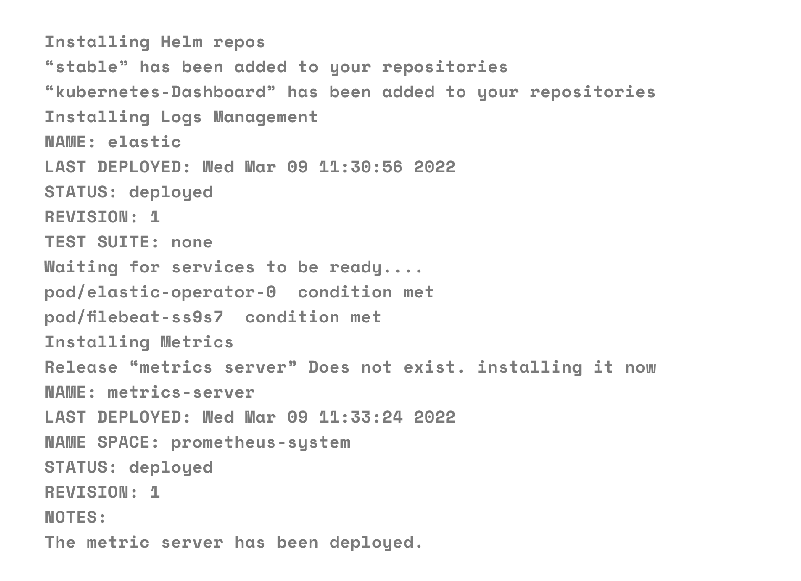
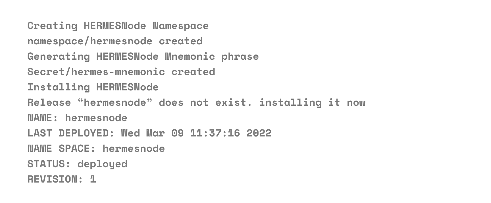

Deploying a HermesNode and its associated services.

## Deploy HermesNode services

Now you have a Kubernetes cluster ready to use, you can install the HermesNode services.

!!! info
    Helm charts are the defacto and currently easiest and simple way to package and deploy Kubernetes application. The team created different Helm charts to help to deploy all the necessary services. Please retrieve the source files from the Git repository here to follow the instructions below:
    [***https://github.com/dojimanetwork/validator-cluster-launcher***](https://github.com/dojimanetwork/validator-cluster-launcher)


## Requirements

 - Running Kubernetes cluster
 - Kubectl configured, ready and connected to running cluster

!!! info 
    If you came here from the Setup page, you are already good to go.


## Steps

Clone the `node-launcher` repo. All commands in this section are to be run inside of this repo.

```
git clone https://github.com/dojimanetwork/helm_charts
cd node-launcher
git checkout master
```
### Install Helm 3

Install Helm 3 if not already available on your current machine:

```
make helm
make helm-plugins
```

### Tools

=== "Deploy"
    To deploy all tools, metrics, logs management, Kubernetes Dashboard, run the command below.

    ```jsx
    make tools
    ```
=== "Destroy"
    To destroy all those resources run the command below.

    ```
    make destroy-tools
    ```


If you are successful, you will see the following message:



If there are any errors, they are typically fixed by running the command again.

## Deploy HermesNode

It is important to deploy the tools first before deploying the HermesNode services as some services will have metrics configuration that would fail and stop the HermesNode deployment.

You have multiple commands available to deploy different configurations of HermesNode. You can deploy testnet or chaosnet/mainnet. The commands deploy the umbrella chart `hermesnode-stack` in the background in the Kubernetes namespace `hermesnode` (or `hermesnode-testnet` for testnet) by default.

```
make install
```

!!! info
    If you are intending to run all chain clients, bond in & earn rewards, you want to choose "Validator".


!!! info
    Deploying a HermesNode will take 1 day for every 3 months of ledger history, since it will validate every block. HermesNodes are "full nodes", not light clients.


If successful, you will see the following:



### Debugging

!!! info
    Set hermesnode to be your default namespace so you don't need to type -n hermesnode each time:
    kubectl config set-context --current --namespace=hermesnode


Use the following useful commands to view and debug accordingly. You should see everything running and active. Logs can be retrieved to find errors:

```
kubectl get pods -n hermesnode
kubectl get pods --all-namespaces
kubectl logs -f <pod> -n hermesnode
```

Kubernetes should automatically restart any service, but you can force a restart by running:

```
kubectl delete pod <pod> -n hermesnode
```

!!! warning

    Note, to expedite syncing external chains, it is feasible to continually delete the pod that has the slow-syncing chain daemon (eg, binance-daemon-xxx).
    Killing it will automatically restart it with free resources and syncing is notably faster. You can check sync status by viewing logs for the client to find the synced chain tip and comparing it with the real-world blockheight, ("xxx" is your unique ID):

    ```
    kubectl logs -f binance-daemon-xxx -n hermesnode
    ```


!!! info
    Get real-world blockheights on the external blockchain explorers, eg:
    [https://testnet-explorer.binance.org/](https://testnet-explorer.binance.org/)

    [https://explorer.binance.org/](https://explorer.binance.org/)


## CHART SUMMARY

#### HermesNode full stack umbrella chart

- **hermesnode**: Umbrella chart packaging all services needed to run a fullnode or validator HermesNode.

This should be the only chart used to run HermesNode stack unless you know what you are doing and want to run each chart separately (not recommended).

**HermesNode services:**

- **hermes-daemon**: HermesNode daemon
- **hermes-api**: HermesNode API
- **hermes-gateway**: HermesNode gateway proxy to get a single IP address for multiple deployments
- **narada**: Narada service

**External services:**

- **binance-daemon**: Binance fullnode daemon
- **bitcoin-daemon**: Bitcoin fullnode daemon
- **ethereum-daemon**: Ethereum fullnode daemon
- **chain-daemon**: as required for supported chains

### Tools

- **elastic**: ELK stack, deperecated. Use elastic-operator chart
- **elastic-operator**: ELK stack using operator for logs management
- **prometheus**: Prometheus stack for metrics
- **loki**: Loki stack for logs
- **kubernetes-dashboard**: Kubernetes dashboard
