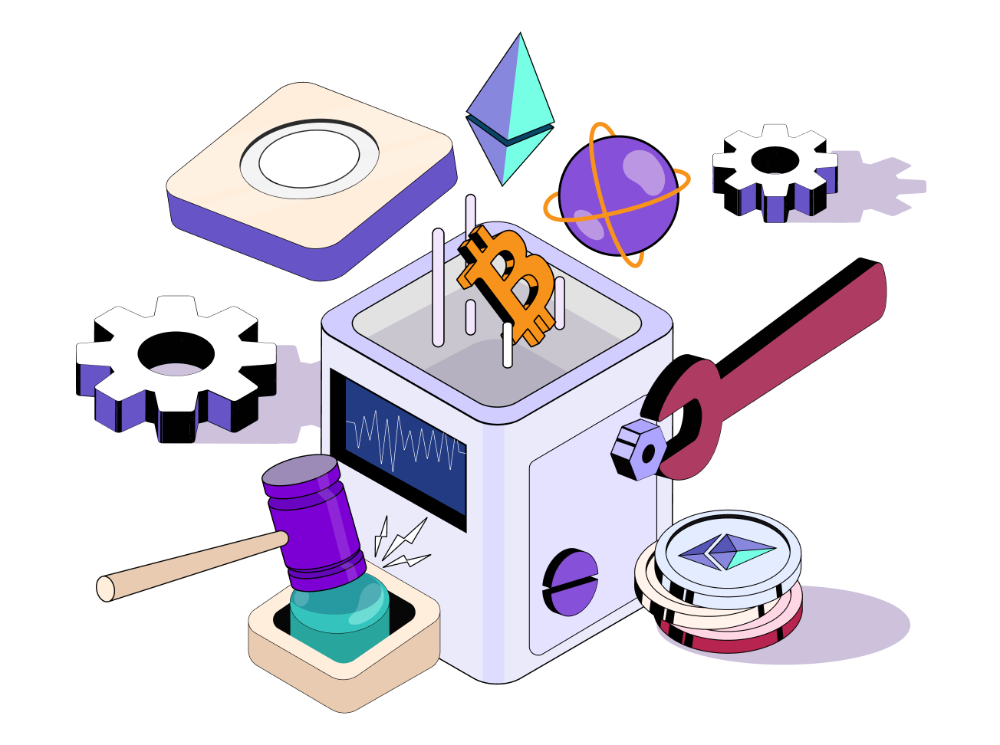

---
hide:
- toc
---

   

   

      <h1 class="hero-heading">Tools</h1>
      
Explore our versatile tools section featuring a cross-chain wallet, innovative FAAS solution, and developer dashboard for seamless integration.

   

    

   

      <a href="/wallet">
         

            
Dojima Wallet

         

         
Dojima wallet lets you organise major layer 1 tokens in one place.

      </a>
   

   

      <a href="/dojima-faas">
         

            
Dojima Fass

         

         
You can get blockchain functionality as a service from Dojima FAAS, like signing transactions, viewing transaction histories and more.

      </a>
   

   

      <a href="./developer-dashboard">
         

            
Developer Dashboard

         

         
Empower your development journey with our intuitive developer dashboard, offering insights, tools, and resources for efficient blockchain integration and application management.

      </a>
   

