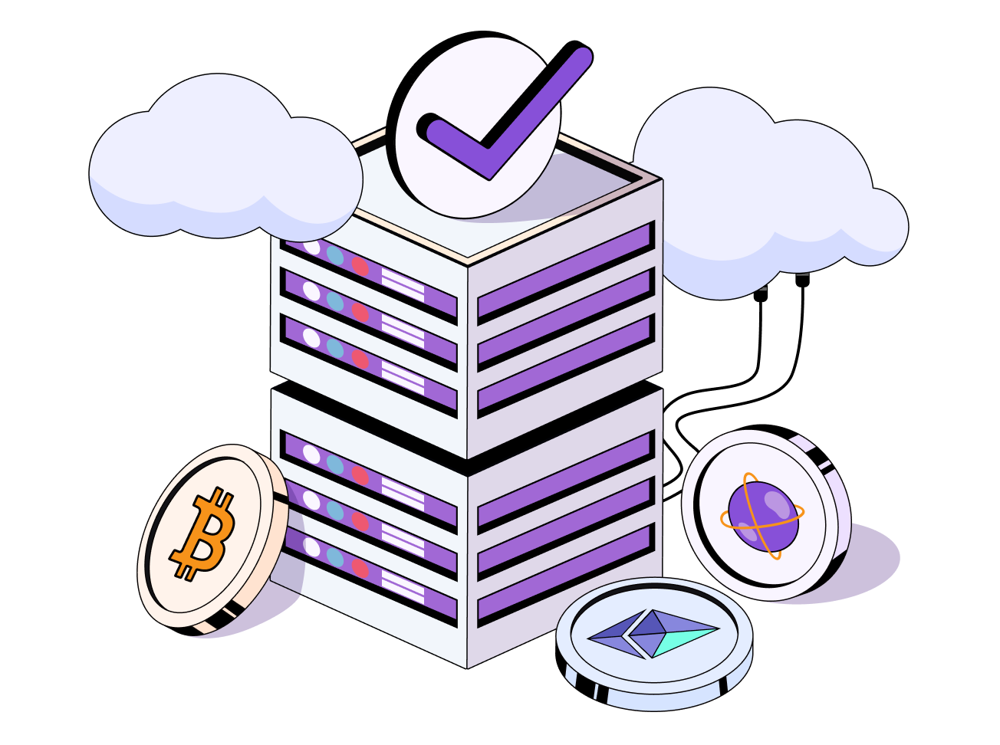

---
hide:
- toc
---

   

   

      <h1 class="hero-heading">Validator</h1>
      
Unlock the path to becoming a valued validator with our comprehensive documentation, empowering you to safeguard the integrity of our blockchain network.

   

    

   

      <a href="/hermes/hermesdeployment/cluster-launcher/setup-aws/">
         

            
Setup AWS

         

         
Step-by-step guide for configuring AWS infrastructure to become a reliable validator in our blockchain network.

      </a>
   

   <!-- 

      <a href="./get-started/quickstart-validium">
         

            
Dojima Fass

         

         
Get started with the CDK validium stack.

      </a>
   
 -->

